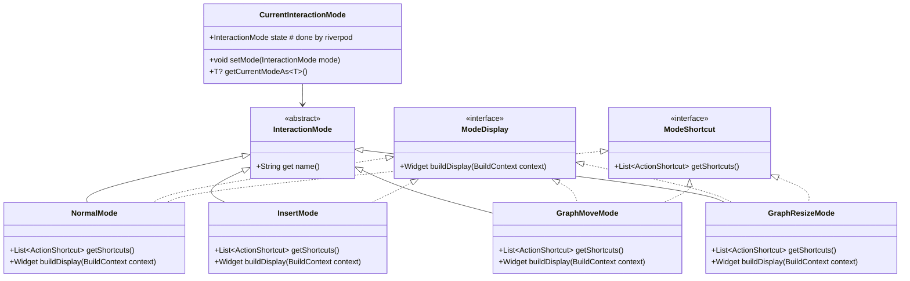
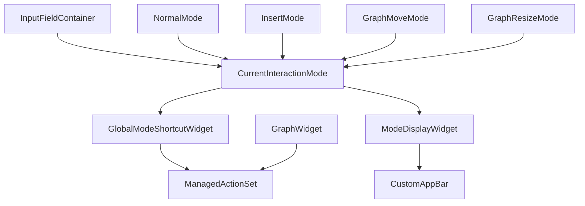

# InteractionMode System Design

## Overview

The InteractionMode system provides a vim-inspired modal interface that allows users to interact with the application through different contextual modes. The system is built around composition and extensibility, enabling developers to create custom interaction modes without modifying core system code.

The architecture follows a clean separation of concerns:
- **Base InteractionMode**: Minimal abstract class for mode foundation
- **Composition Interfaces**: Mixins and interfaces for specific capabilities
- **State Management**: Riverpod-based tracking of current mode
- **Integration Layer**: Bridges between modes and existing systems (managed actions, app bar)

## Architecture

### Core Components



### Integration Architecture



## Components and Interfaces

### Base InteractionMode Class

```dart
abstract class InteractionMode {
  String get name;
}
```

### Composition Interfaces

#### ModeDisplay
```dart
mixin ModeDisplay on InteractionMode {
  Widget buildDisplay(BuildContext context);
}
```

#### ModeShortcut
```dart
mixin ModeShortcut on InteractionMode {
  List<ActionShortcut> getShortcuts();
}
```

### State Management

#### CurrentInteractionMode
```dart
@riverpod
class CurrentInteractionMode extends _$CurrentInteractionMode {
  @override
  InteractionMode build() => NormalMode();
  
  void setMode(InteractionMode mode) {
    final previousMode = state;
    state = mode;
  }
  
  T? getCurrentModeAs<T extends InteractionMode>() {
    return state is T ? state as T : null;
  }
}
```

### Shared Display Widget

#### ModeDisplayChip
```dart
class ModeDisplayChip extends StatelessWidget {
  final String label;
  final Color color;
  
  const ModeDisplayChip({
    required this.label,
    required this.color,
  });
  
  @override
  Widget build(BuildContext context) {
    return Container(
      padding: EdgeInsets.symmetric(horizontal: 8, vertical: 4),
      decoration: BoxDecoration(
        color: color.withOpacity(0.1),
        borderRadius: BorderRadius.circular(4),
      ),
      child: Text(
        label.toUpperCase(),
        style: TextStyle(
          fontSize: 12,
          color: color,
          fontWeight: FontWeight.w500,
        ),
      ),
    );
  }
}
```

### Concrete Mode Implementations

#### NormalMode
```dart
class NormalMode extends InteractionMode 
    with ModeDisplay, ModeShortcut {
  @override
  String get name => 'Normal';
  
  @override
  Widget buildDisplay(BuildContext context) {
    return ModeDisplayChip(
      label: 'Normal',
      color: Theme.of(context).primaryColor,
    );
  }
  
  @override
  List<ActionShortcut> getShortcuts() {
    return [
      ActionShortcut(
        key: LogicalKeyboardKey.arrowUp,
        description: 'Move focus up',
        onInvoke: (ref) => _moveFocus(FocusDirection.up),
      ),
      ActionShortcut(
        key: LogicalKeyboardKey.arrowDown,
        description: 'Move focus down',
        onInvoke: (ref) => _moveFocus(FocusDirection.down),
      ),
      ActionShortcut(
        key: LogicalKeyboardKey.arrowLeft,
        description: 'Move focus left',
        onInvoke: (ref) => _moveFocus(FocusDirection.left),
      ),
      ActionShortcut(
        key: LogicalKeyboardKey.arrowRight,
        description: 'Move focus right',
        onInvoke: (ref) => _moveFocus(FocusDirection.right),
      ),
      // hjkl variants
      ActionShortcut(
        key: LogicalKeyboardKey.keyH,
        description: 'Move focus left',
        onInvoke: (ref) => _moveFocus(FocusDirection.left),
      ),
      ActionShortcut(
        key: LogicalKeyboardKey.keyJ,
        description: 'Move focus down',
        onInvoke: (ref) => _moveFocus(FocusDirection.down),
      ),
      ActionShortcut(
        key: LogicalKeyboardKey.keyK,
        description: 'Move focus up',
        onInvoke: (ref) => _moveFocus(FocusDirection.up),
      ),
      ActionShortcut(
        key: LogicalKeyboardKey.keyL,
        description: 'Move focus right',
        onInvoke: (ref) => _moveFocus(FocusDirection.right),
      ),
    ];
  }
  
  void _moveFocus(FocusDirection direction) {
    FocusScope.of(navigatorKey.currentContext!).requestFocus(
      FocusScope.of(navigatorKey.currentContext!)
          .focusedChild
          ?.nearestScope
          ?.getDirectionalFocusNode(direction)
    );
  }
}
```

#### InsertMode
```dart
class InsertMode extends InteractionMode with ModeDisplay {
  @override
  String get name => 'Insert';
  
  @override
  Widget buildDisplay(BuildContext context) {
    return ModeDisplayChip(
      label: 'Insert',
      color: Colors.green,
    );
  }
}
```

#### Graph Manipulation Modes
```dart
class GraphMoveMode extends InteractionMode 
    with ModeDisplay, ModeShortcut {
  @override
  String get name => 'Graph Move';
  
  @override
  Widget buildDisplay(BuildContext context) {
    return ModeDisplayChip(
      label: 'Move',
      color: Colors.blue,
    );
  }
  
  @override
  List<ActionShortcut> getShortcuts() {
    return [
      ActionShortcut(
        key: LogicalKeyboardKey.arrowUp,
        description: 'Move node up',
        onInvoke: (ref) => _moveSelectedNode(0, -10),
      ),
      ActionShortcut(
        key: LogicalKeyboardKey.arrowDown,
        description: 'Move node down',
        onInvoke: (ref) => _moveSelectedNode(0, 10),
      ),
      ActionShortcut(
        key: LogicalKeyboardKey.arrowLeft,
        description: 'Move node left',
        onInvoke: (ref) => _moveSelectedNode(-10, 0),
      ),
      ActionShortcut(
        key: LogicalKeyboardKey.arrowRight,
        description: 'Move node right',
        onInvoke: (ref) => _moveSelectedNode(10, 0),
      ),
      // hjkl variants
      ActionShortcut(
        key: LogicalKeyboardKey.keyH,
        description: 'Move node left',
        onInvoke: (ref) => _moveSelectedNode(-10, 0),
      ),
      ActionShortcut(
        key: LogicalKeyboardKey.keyJ,
        description: 'Move node down',
        onInvoke: (ref) => _moveSelectedNode(0, 10),
      ),
      ActionShortcut(
        key: LogicalKeyboardKey.keyK,
        description: 'Move node up',
        onInvoke: (ref) => _moveSelectedNode(0, -10),
      ),
      ActionShortcut(
        key: LogicalKeyboardKey.keyL,
        description: 'Move node right',
        onInvoke: (ref) => _moveSelectedNode(10, 0),
      ),
      // Escape to normal mode
      ...escapeToNormalAction(),
    ];
  }
  
  void _moveSelectedNode(double deltaX, double deltaY) {
    // Implementation will interact with graph state
  }
}

class GraphResizeMode extends InteractionMode 
    with ModeDisplay, ModeShortcut {
  @override
  String get name => 'Graph Resize';
  
  @override
  Widget buildDisplay(BuildContext context) {
    return ModeDisplayChip(
      label: 'Resize',
      color: Colors.orange,
    );
  }
  
  @override
  List<ActionShortcut> getShortcuts() {
    return [
      ActionShortcut(
        key: LogicalKeyboardKey.arrowUp,
        description: 'Decrease height',
        onInvoke: (ref) => _resizeSelectedNode(0, -5),
      ),
      ActionShortcut(
        key: LogicalKeyboardKey.arrowDown,
        description: 'Increase height',
        onInvoke: (ref) => _resizeSelectedNode(0, 5),
      ),
      ActionShortcut(
        key: LogicalKeyboardKey.arrowLeft,
        description: 'Decrease width',
        onInvoke: (ref) => _resizeSelectedNode(-5, 0),
      ),
      ActionShortcut(
        key: LogicalKeyboardKey.arrowRight,
        description: 'Increase width',
        onInvoke: (ref) => _resizeSelectedNode(5, 0),
      ),
      // hjkl variants
      ActionShortcut(
        key: LogicalKeyboardKey.keyH,
        description: 'Decrease width',
        onInvoke: (ref) => _resizeSelectedNode(-5, 0),
      ),
      ActionShortcut(
        key: LogicalKeyboardKey.keyJ,
        description: 'Increase height',
        onInvoke: (ref) => _resizeSelectedNode(0, 5),
      ),
      ActionShortcut(
        key: LogicalKeyboardKey.keyK,
        description: 'Decrease height',
        onInvoke: (ref) => _resizeSelectedNode(0, -5),
      ),
      ActionShortcut(
        key: LogicalKeyboardKey.keyL,
        description: 'Increase width',
        onInvoke: (ref) => _resizeSelectedNode(5, 0),
      ),
      // Escape to normal mode
      ...escapeToNormalAction(),
    ];
  }
  
  void _resizeSelectedNode(double deltaWidth, double deltaHeight) {
    // Implementation will interact with graph state
  }
}
```

### Integration Widgets

#### GlobalModeShortcutWidget
```dart
class GlobalModeShortcutWidget extends ConsumerWidget {
  final Widget child;
  
  const GlobalModeShortcutWidget({required this.child});
  
  @override
  Widget build(BuildContext context, WidgetRef ref) {
    final currentMode = ref.watch(currentInteractionModeProvider);
    
    List<ActionShortcut> shortcuts = [];
    if (currentMode is ModeShortcut) {
      shortcuts = (currentMode as ModeShortcut).getShortcuts();
    }
    
    return ManagedActionSet(
      actions: shortcuts,
      child: child,
    );
  }
}
```

#### ModeDisplayWidget
```dart
class ModeDisplayWidget extends ConsumerWidget {
  @override
  Widget build(BuildContext context, WidgetRef ref) {
    final currentMode = ref.watch(currentInteractionModeProvider);
    
    if (currentMode is ModeDisplay) {
      return (currentMode as ModeDisplay).buildDisplay(context);
    }
    
    return SizedBox.shrink();
  }
}
```

#### Enhanced InputFieldContainer
```dart
class InputFieldContainer extends HookConsumerWidget {
  final Widget child;
  final FocusNode? focusNode;
  
  const InputFieldContainer({
    required this.child,
    this.focusNode,
  });
  
  @override
  Widget build(BuildContext context, WidgetRef ref) {
    final surroundingFocusNode = useMemoized(() => focusNode ?? FocusNode());
    final innerFocusNode = useFocusNode();
    final preventModeChangeLoop = useRef(false);
    
    // Listen to inner focus changes
    useEffect(() {
      void onInnerFocusChange() {
        if (preventModeChangeLoop.value) return;
        
        if (innerFocusNode.hasFocus) {
          final currentMode = ref.read(currentInteractionModeProvider);
          if (currentMode is! InsertMode) {
            preventModeChangeLoop.value = true;
            ref.read(currentInteractionModeProvider.notifier).setMode(InsertMode());
            preventModeChangeLoop.value = false;
          }
        }
      }
      
      innerFocusNode.addListener(onInnerFocusChange);
      return () => innerFocusNode.removeListener(onInnerFocusChange);
    }, [innerFocusNode]);
    
    // Listen to surrounding focus changes
    useEffect(() {
      void onSurroundingFocusChange() {
        if (preventModeChangeLoop.value) return;
        
        if (!surroundingFocusNode.hasFocus && !innerFocusNode.hasFocus) {
          final currentMode = ref.read(currentInteractionModeProvider);
          if (currentMode is InsertMode) {
            preventModeChangeLoop.value = true;
            ref.read(currentInteractionModeProvider.notifier).setMode(NormalMode());
            preventModeChangeLoop.value = false;
          }
        }
      }
      
      surroundingFocusNode.addListener(onSurroundingFocusChange);
      return () => surroundingFocusNode.removeListener(onSurroundingFocusChange);
    }, [surroundingFocusNode, innerFocusNode]);
    
    // Listen to mode changes and update focus accordingly
    ref.listen(currentInteractionModeProvider, (previous, current) {
      if (preventModeChangeLoop.value) return;
      
      preventModeChangeLoop.value = true;
      
      if (current is InsertMode && surroundingFocusNode.hasPrimaryFocus) {
        innerFocusNode.requestFocus();
      } else if (current is! InsertMode && innerFocusNode.hasPrimaryFocus) {
        surroundingFocusNode.requestFocus();
      }
      
      preventModeChangeLoop.value = false;
    });
    
    return Focus(
      focusNode: surroundingFocusNode,
      child: Focus(
        focusNode: innerFocusNode,
        child: child,
      ),
    );
  }
}
```

## Data Models

### ActionShortcut Integration
The system leverages the existing `ActionShortcut` class:

```dart
@freezed
abstract class ActionShortcut with _$ActionShortcut {
  const factory ActionShortcut({
    required String id,
    required String label,
    required String description,
    required List<ShortcutActivator> activators,
    required int priority,
    Widget? icon,
    ActionInvoke? onInvoke,
    GlobalKey? owner,
  }) = _ActionShortcut;
}
```

### Mode State Data
Modes can store additional state by extending the base class:

```dart
class CustomMode extends InteractionMode {
  final String customData;
  final int customValue;
  
  CustomMode({
    required this.customData,
    required this.customValue,
  });
  
  @override
  String get name => 'Custom';
}
```

## Error Handling

### Mode Transition Safety
- All mode transitions go through the `CurrentInteractionMode`
- Modes are stateless, so no lifecycle management is needed
- If a mode transition fails, the system falls back to `NormalMode`

### Focus Management Safety
- Loop prevention mechanisms in `InputFieldContainer`
- Graceful handling of focus node disposal
- Fallback focus behavior when nodes become unavailable

### Action Registration Safety
- Null checks for mode interfaces before casting
- Empty action lists when modes don't implement `ModeShortcut`
- Automatic cleanup of previous mode's actions

## Testing Strategy

### Unit Tests
- Test each mode's interface implementations
- Test focus management logic with various scenarios
- Test action registration and cleanup

### Integration Tests
- Test complete mode workflows (normal → insert → normal)
- Test graph manipulation mode integration
- Test app bar display updates
- Test managed action set integration

### Widget Tests
- Test `GlobalModeShortcutWidget` with different modes
- Test `ModeDisplayWidget` rendering
- Test `InputFieldContainer` focus behavior
- Test mode-specific shortcut handling

## Utility Functions

### Escape to Normal Helper
```dart
List<ActionShortcut> escapeToNormalAction() {
  return [
    ActionShortcut(
      key: LogicalKeyboardKey.escape,
      description: 'Return to normal mode',
      onInvoke: (ref) {
        ref.read(currentInteractionModeProvider.notifier).setMode(NormalMode());
      },
    ),
  ];
}
```

This design provides a flexible, extensible modal interface system that integrates cleanly with existing Flutter/Riverpod architecture while supporting the specific use cases of graph manipulation and text editing modes.